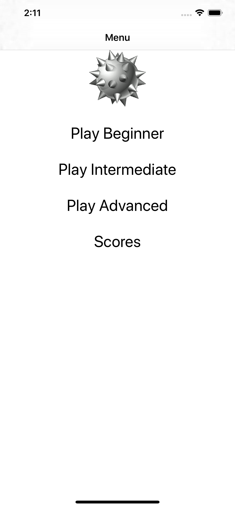
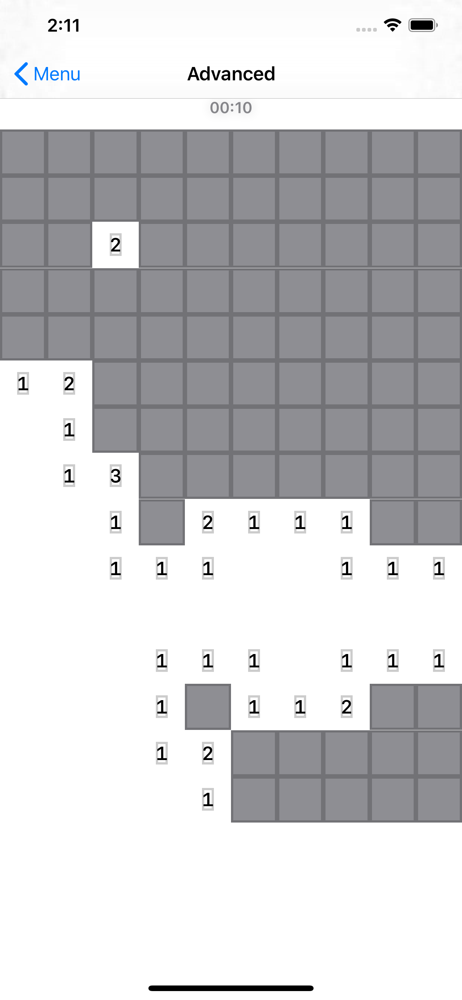
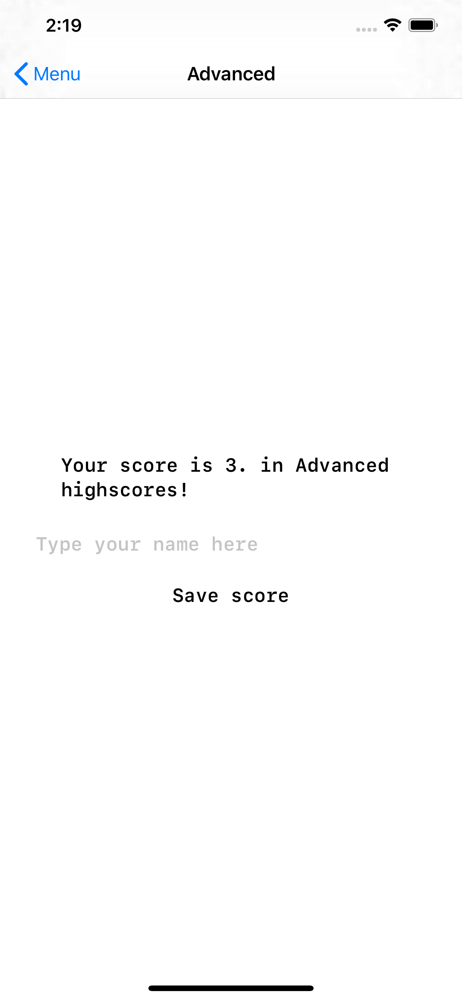
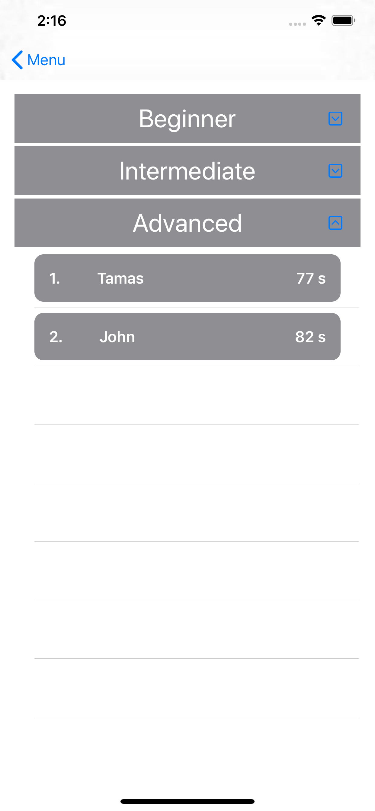

# ios-minesweeper

Basic Minesweeper written in SwiftUI

There are 3 different level of difficulty:

- beginner - 5x5 map, 7 bombs
- intermediate - 10x7 map, 12 bombs
- advanced - 15x10 map, 18 bombs

Tap to reveal field, long press to place flag.

Scores (time in seconds) saved in Core Data - top 10 score for each difficulty.

